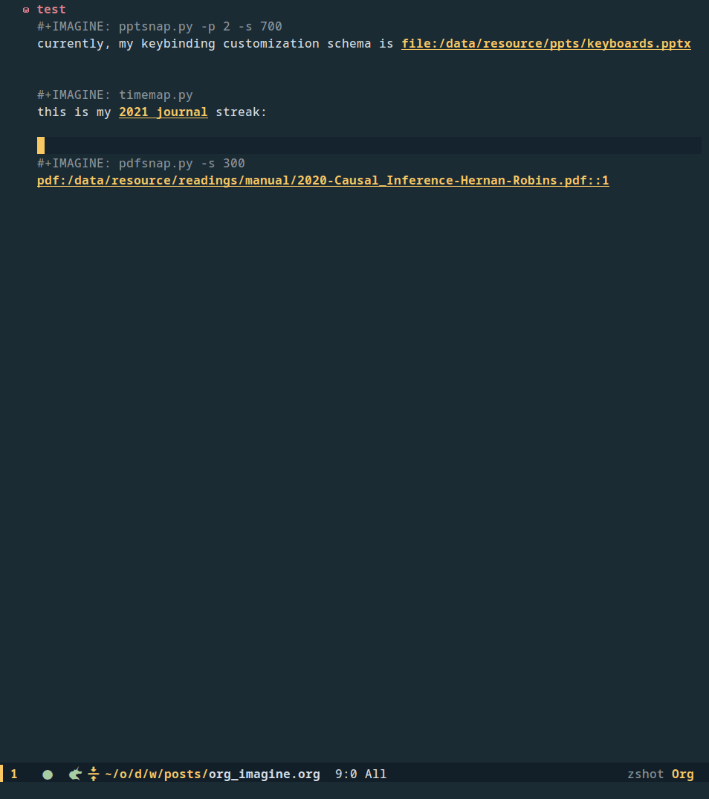

# org-imagine

Org-imagine is a visualization decorator for org-mode element, its purpose is to make inserting images in emacs org-mode easier, programmatic, and more fun



## Install

`cd ~/.emacs.d/site-lisp/; git clone git@github.com:metaescape/org-imagine.git`

`cd org-imagine; git submodule update --init` if you want to use predifined visulization scripts in `org-imagine/view/`

then install it with `use-package` or your favorite emacs package manager:

```elisp
(use-package org-imagine
  :load-path "~/.emacs.d/site-lisp/org-imagine/")
```

# Usage

Here are two examples for explaining how to use org-imagine.

## Use case: Random Cover image generator

Downloads and preview random images from picsum:

- before executing org-imagine-view:

```
#+IMAGINE: wget -O %{%o.png} %f
[[https://picsum.photos/1366/768/\?random]]
#+ATTR_HTML: :width 800 :align center
```

- put cursor on `#+IMAGINE` or below and M-x org-imagine-view, then

```org
#+IMAGINE: wget -O %{%o.png} %f
[[https://picsum.photos/1366/768/\?random]]
#+ATTR_HTML: :width 800 :align center
[[file:./.org-imagine/N-T-7bbbd1174f.png]]
```

`%o`, `%{}` and `%f` are special [%-escapes](https://orgmode.org/manual/Template-expansion.html#FOOT86) allow dynamic insertion/substitution of content

- `%o` will be substituted by an image name in the form of `filename-last_modified-hash`
- `%{}` is an anchor to tell org-imagine that the content within it will be used as an image path which will be inserted later, allowing user-specified image path, e.g. `#+IMAGINE: wget -O %{/tmp/cover.png} %f`
- `%f` will be substituted by the first org link in the next line of `#+IMAGINE` comment line, currently support link formats:
  - `[[file:path_of_file::page]]` extract `path_of_file`
  - `[[pdf:file.pdf]]` extract `file.pdf`
  - `[[id:xxxxx]]` extract the file path of org id `xxxxx`
  - `[[http://url_of_image.jpg]]` extract `http://url_of_image.jpg`
  - `[[https://url_of_image.png]]` extract `https://url_of_image.png`

other templates:

- `%l`: substituted by the content of the next line

## Use case: preview PPT link

- before executing org-imagine-view:

```elisp
#+IMAGINE: pptsnap.py -p 2
this is my [[file:~/keyboards.pptx][custom keybinding]]
```

- put cursor on `#+IMAGINE` or below and M-x org-imagine-view

  - when detecting a command without `%s-escape`, org-imagine will add `-l=link` and `-d=org-imagine-cache-dir` options
    so after parsing, the real command is `pptsnap.py -p 2 -l="[[file:~/keyboards.pptx]]" -d=./.org-imagine`

  - pptsnap.py is an executable python script (command-line interface) in `org-imagine-dir`, it uses `LibreOffice` and `pdftoppm`(or `pyMupdf`) to generate the preview of the second page of `~/keyboards.pptx` in `org-imagine-cache-dir` with naming convention `filename-last_modified-hash.png`

- after executing org-imagine-view:

```elisp
#+IMAGINE: pptsnap.py -p 2
this is my [[file:~/keyboards.pptx][custom keybinding]]
[[file:./.org-imagine/keyboards-20220903232619-25822.png]]
```

## Customization

- `org-imagine-view-dir`: where user-defined visualiser locate, default is "/path/to/org-imagine/view/"

```elisp
(use-package org-imagine
  :load-path "~/.emacs.d/site-lisp/org-imagine/"
  :config
  (setq
    org-imagine-cache-dir "./.org-imagine"
    org-imagine-is-overwrite nil)
    )
```

Using `org-imagine-clear-cache` to clear unlinked image files (like garbage-collection)

## other usage scenarios

- stable-diffusion webui api:

```org
#+IMAGINE: sdtext2img.py -e 192.168.168.2:7861 -o %{%o.png} -j %f
[[file:~/.emacs.d/site-lisp/org-imagine/view/stable_diffusion_demo.json]]
```

- preview of drawio

```org
#+IMAGINE: drawio -x %f -o %{%o.png} -p 4 --width 800
[[file:~/org/lib/scratch.drawio]]
```

- preview of fonts

```org
#+IMAGINE: pango-view --font="Slidefu" -qo %{/tmp/image3.png} -t %l --dpi 400
但愿人长久，千里共婵娟
```

- preview of pdf

```org
#+IMAGINE: pdfsnap.py -s 70
[[pdf:/book/2020-Causal_Inference-Hernan-Robins.pdf::1]]
```

or

```org
#+IMAGINE: pdftoppm -png -f 1 -scale-to 100 -singlefile %f %{%o}
[[pdf:/book/2020-Causal_Inference-Hernan-Robins.pdf::1]]
```

- streak of org jounal

```org
#+IMAGINE: timemap.py
this is my [[file:~/org/journal/j2021.org][2021 journal]] streak:
[[file:./.org-imagine/j2021-20220804002339-051d8.png]]
```

## Misc

Yasnippets for quick decoration:

```
#+IMAGINE: ${0:pdfsnap.py} -s 300
[[pdf:$0]]
```

```
#+IMAGINE: wget -O %{%o.png} %f
[[$0]]
```

```
#+ATTR_HTML: :width ${0:800} :align center
```

中文的说明和讨论： [org-imagine： 对 org 对象进行可视化的插件](https://emacs-china.org/t/org-imagine-org/22134)

中文 Blog： [org imagine: 在 org-mode 中想象](https://www.hugchange.life/posts/org_imagine.html)
